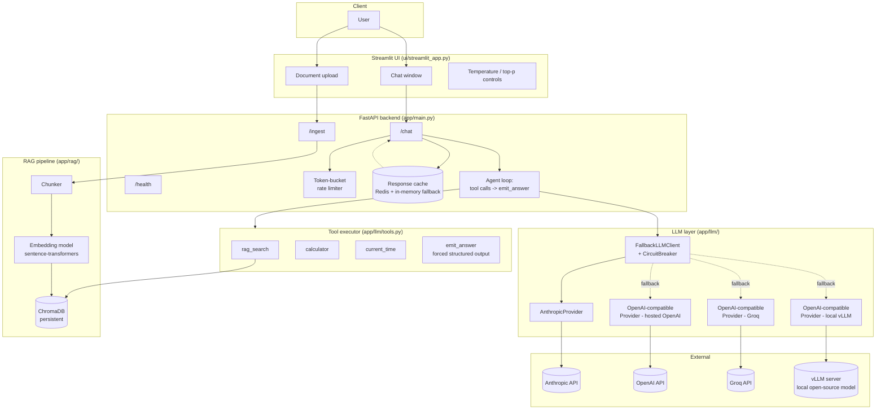
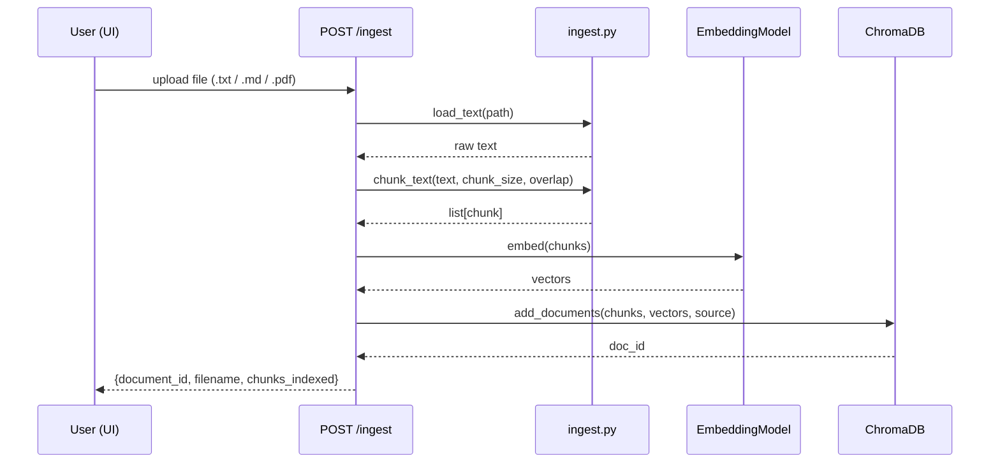
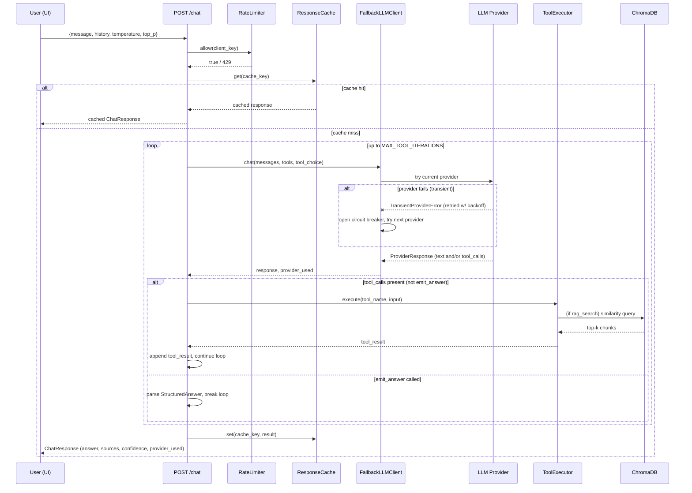
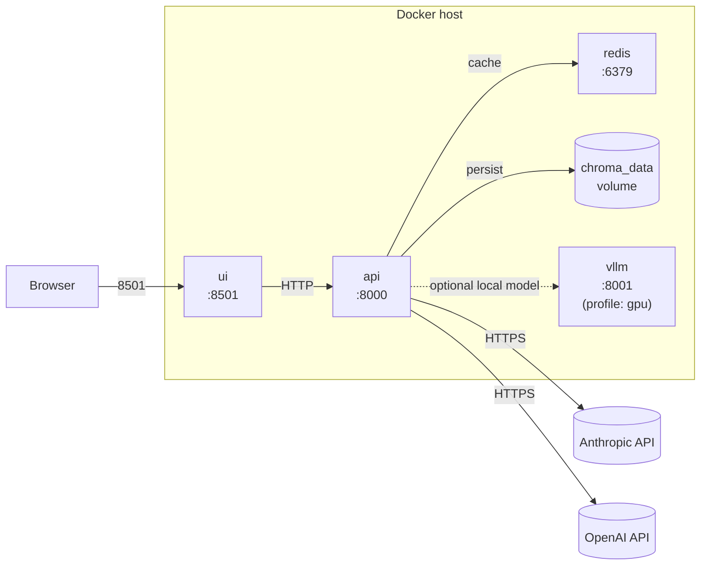

# Architecture

## 1. System overview

**Request flow, in words:** the UI calls the FastAPI `/chat` endpoint → a
rate limiter and cache check gate the request → if not cached, the agent loop
sends the conversation to the LLM layer, which tries providers in priority
order (Anthropic, then OpenAI, then Groq, then a local vLLM model) behind a
circuit breaker → the model can call `rag_search` (hits the Chroma vector
store), `calculator`, or `current_time` before ending the loop by calling
`emit_answer`, which is the only way the loop terminates with a result → the
final structured JSON is cached and returned.

Groq and hosted OpenAI both go through the same `OpenAICompatibleProvider`
class (just a different `base_url`/model), since Groq's API is an
OpenAI-compatible `/v1/chat/completions` endpoint including function calling
— no separate integration code was needed.

## 2. RAG ingestion pipeline

## 3. Chat request: agent loop + provider fallback

## 4. Deployment topology (docker-compose.yml)

The `vllm` service is behind the `gpu` Compose profile (`docker compose
--profile gpu up`) since it requires an NVIDIA GPU and is optional — the
app runs fully with just Anthropic and/or OpenAI configured.
