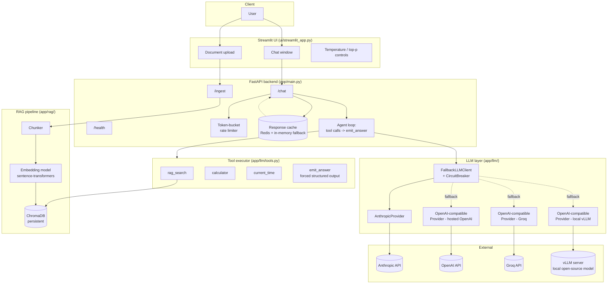
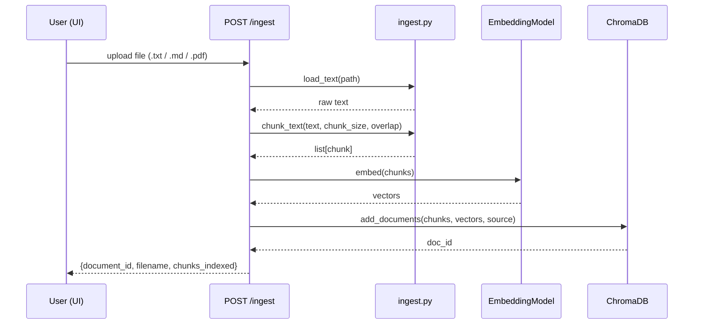
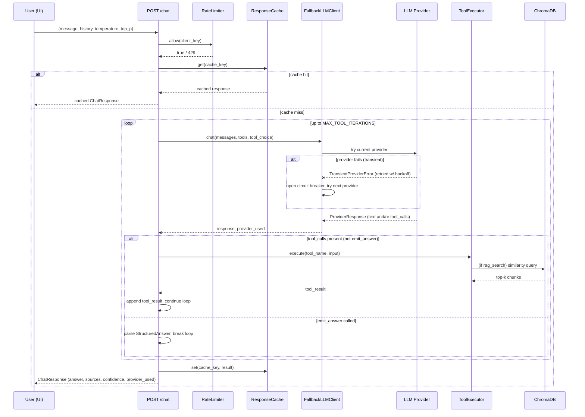
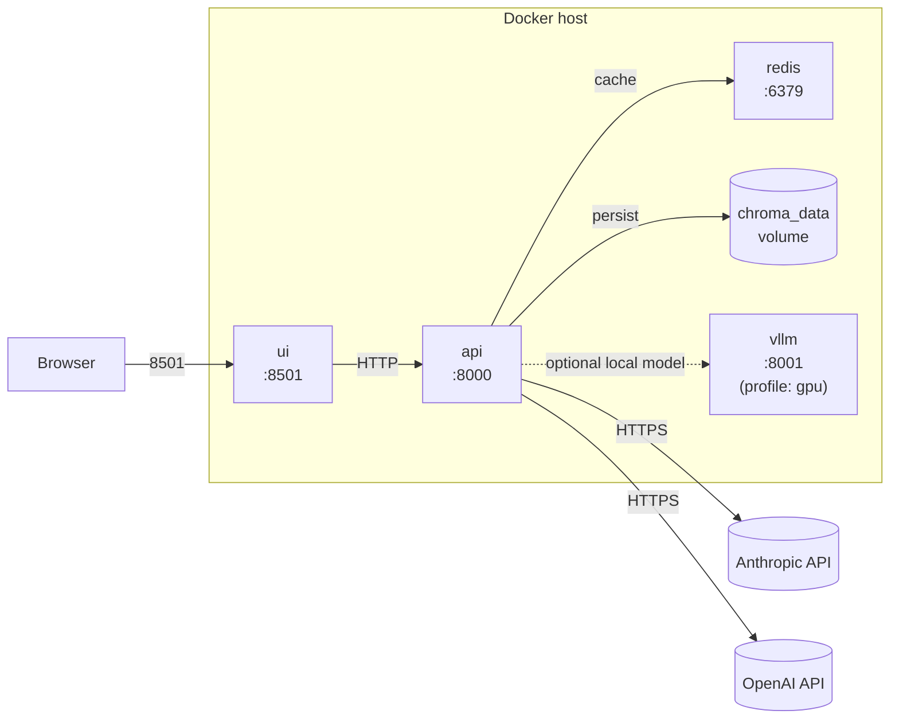
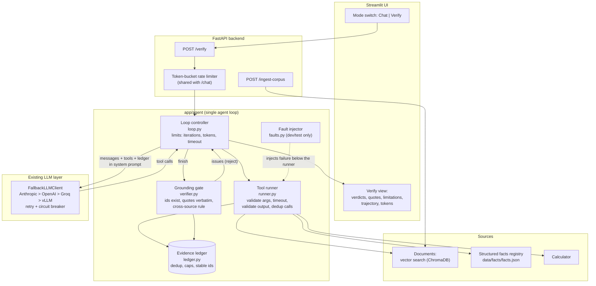
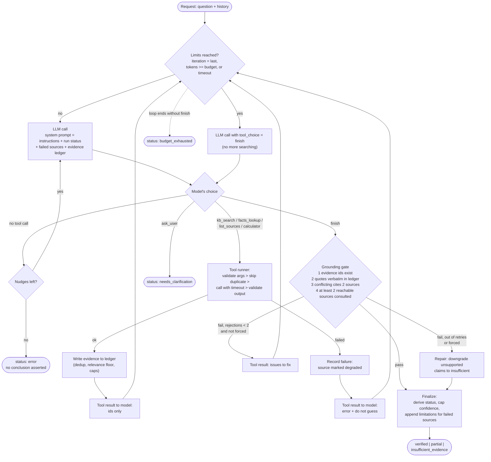
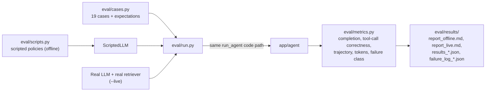

# Architecture

## 1. System overview

**Request flow, in words:** the UI calls the FastAPI `/chat` endpoint → a
rate limiter and cache check gate the request → if not cached, the agent loop
sends the conversation to the LLM layer, which tries providers in priority
order (Anthropic, then OpenAI, then Groq, then a local vLLM model) behind a
circuit breaker → the model can call `rag_search` (hits the Chroma vector
store), `calculator`, or `current_time` before ending the loop by calling
`emit_answer`, which is the only way the loop terminates with a result → the
final structured JSON is cached and returned.

Groq and hosted OpenAI both go through the same `OpenAICompatibleProvider`
class (just a different `base_url`/model), since Groq's API is an
OpenAI-compatible `/v1/chat/completions` endpoint including function calling
— no separate integration code was needed.

## 2. RAG ingestion pipeline

## 3. Chat request: agent loop + provider fallback

## 4. Deployment topology (docker-compose.yml)

The `vllm` service is behind the `gpu` Compose profile (`docker compose
--profile gpu up`) since it requires an NVIDIA GPU and is optional — the
app runs fully with just Anthropic and/or OpenAI configured.

---

# Week 16 additions: the agentic verification loop

Sections 1–4 above are unchanged in structure. W16 adds one endpoint (`POST /verify`) and the `app/agent/` package.
It reuses the existing `FallbackLLMClient` (provider chain, retry, circuit breaker), the rate limiter and the vector store.
It deliberately bypasses the response cache.

## 5. Where the agent plugs into the system

## 6. The loop: what the model decides and what the application guarantees

## 7. Failure handling at each boundary

| Where | Failure | What the system does |
|---|---|---|
| Tool arguments | wrong type / missing field | `invalid_arguments` result naming the problem; model can retry |
| Tool call | source down, or hangs past `AGENT_TOOL_TIMEOUT_SECONDS` | `unavailable` / `timeout` result; source recorded as degraded |
| Tool output | wrong shape (`malformed_output`) | rejected before it can become evidence; treated like an outage |
| Search | nothing relevant, or the same passages again | empty / duplicate hint; ledger dedups; model reformulates or switches source |
| `finish` | fabricated id or quote, single source, weak conflict | rejected with specific issues (max 2), then repaired by downgrade |
| Degraded run | any unrecovered source failure | `Limitations:` appended, `degraded: true`, confidence ≤ 0.6, status ≤ `partial` |
| LLM | every provider fails | `status: error` with the evidence gathered so far, HTTP 200 |
| Budget | iterations / tokens / time | last call forced to `finish`; otherwise `budget_exhausted`, no conclusion asserted |

## 8. Evaluation harness

The harness calls `run_agent` directly (no HTTP), so live and offline runs execute the same loop, runner and gate. Only the
model and the retriever are swapped.

## 9. Deployment delta

`docker-compose.yml` gains one bind mount (`./eval/results` → `/app/eval/results`) so reports written inside the container
appear on the host. The image now also copies `scripts/` and `eval/`. Load the demo corpus with
`POST /api/v1/ingest-corpus` (in-process; do not open the Chroma directory from a second writing process).

